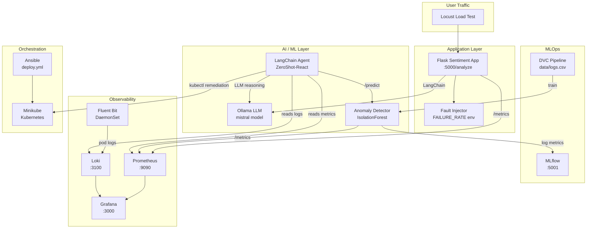

# AIOpsGuard

> **Local AI‑Driven Operations for a Flask‑Based Sentiment‑Analysis Service**

AIOpsGuard demonstrates end‑to‑end MLOps and AIOps practices — anomaly detection,
AI‑driven root‑cause analysis, and automated remediation — entirely on a developer
workstation using only free and open‑source tools.

---

## Architecture Overview



---

## Prerequisites

| Tool | Version | Install |
|------|---------|---------|
| Docker | ≥ 24 | [docs.docker.com](https://docs.docker.com/get-docker/) |
| Minikube | ≥ 1.32 | [minikube.sigs.k8s.io](https://minikube.sigs.k8s.io/docs/start/) |
| kubectl | ≥ 1.28 | [kubernetes.io](https://kubernetes.io/docs/tasks/tools/) |
| Ollama | ≥ 0.1.32 | [ollama.com](https://ollama.com/download) |
| Python | 3.10+ | [python.org](https://www.python.org/downloads/) |
| DVC | ≥ 3.0 | `pip install dvc` |
| Git | ≥ 2.40 | [git-scm.com](https://git-scm.com/) |
| Ansible | ≥ 9 | `pip install ansible` |

---

## Quick Start

### 1. Clone the repository

```bash
git clone https://github.com/sadiqhussain13/AIOpsGuard-Local-AI-Driven-Operations-for-a-Sentiment-Analysis-Service.git
cd AIOpsGuard-Local-AI-Driven-Operations-for-a-Sentiment-Analysis-Service
```

### 2. Pull the Ollama model

```bash
ollama pull mistral
```

### 3. Install Python dependencies

```bash
pip install -r app/requirements.txt
pip install -r anomaly_detector/requirements.txt
```

### 4. Train the anomaly detection model

```bash
make train
```

### 5. Option A – Full Kubernetes deployment (Ansible)

```bash
ansible-playbook ansible/deploy.yml
```

Access the services:

| Service | URL |
|---------|-----|
| Flask API | `http://<minikube-ip>:30080/analyze` |
| Grafana | `http://<minikube-ip>:30300` (admin/admin) |
| Prometheus | `http://<minikube-ip>:30090` |
| MLflow | `http://<minikube-ip>:30501` |

### 5. Option B – Docker Compose (quick local demo)

```bash
make up
```

Access the services at `localhost` on the same ports.

---

## Usage

### Sentiment analysis request

```bash
curl -X POST http://localhost:5000/analyze \
  -H "Content-Type: application/json" \
  -d '{"text": "This product is absolutely fantastic!"}'
```

Response:
```json
{"sentiment": "positive"}
```

### Anomaly detection prediction

```bash
curl -X POST http://localhost:8080/predict \
  -H "Content-Type: application/json" \
  -d '[200.0, 40.0, 50.0, 0.01, 300.0]'
```

Response:
```json
{"anomaly": false, "score": -0.123456}
```

---

## Load Testing

```bash
# Run with Locust web UI
locust -f load_test/locustfile.py --host http://localhost:5000

# Headless mode (50 users, 2 minutes)
locust -f load_test/locustfile.py --host http://localhost:5000 \
       --headless -u 50 -r 5 -t 2m
```

---

## AI‑Driven Remediation

The LangChain agent (`agent/agent.py`) runs every minute (via `agent/run_agent.sh`)
and performs the following steps:

1. Reads recent logs from **Loki**
2. Queries **Prometheus** for error rates and latency trends
3. Calls the **anomaly detector** with current metrics
4. Uses **Ollama** (local LLM) to reason about the root cause
5. Generates a **bash remediation script** with `kubectl` commands
6. Applies the script only if the LLM's output contains the word **"apply"**

Decisions are logged to `/var/log/aiopsguard/agent.log`.

### Run the agent manually

```bash
python agent/agent.py
# or
bash agent/run_agent.sh
```

---

## Observability

### Grafana Dashboards

After deployment, import `monitoring/grafana-dashboard.json` into Grafana:

1. Open Grafana at `http://localhost:3000`
2. Go to **Dashboards → Import**
3. Upload `monitoring/grafana-dashboard.json`

**Screenshot placeholder:**


### MLflow UI

Track model training runs at `http://localhost:5001`.

**Screenshot placeholder:**


---

## Fault Injection

Control the fault injection rate via environment variable:

```bash
FAILURE_RATE=0.2 python -m app.app   # 20% of requests return HTTP 500
```

In Kubernetes, patch the deployment:

```bash
kubectl set env deployment/sentiment-app FAILURE_RATE=0.3
```

---

## Security Hardening

- All containers run as **non-root** users (UID 1001).
- Root filesystems are **read-only** where possible.
- Pod capabilities are **dropped** (`ALL`).
- Secrets are stored in Kubernetes `Secret` objects (not in ConfigMaps).
- The Ansible playbook does not store credentials in plain text.
- Docker images use **multi-stage builds** to minimise attack surface.

---

## Resume Bullets

- Designed and delivered **AIOpsGuard**, a local AI‑driven monitoring pipeline that reduced simulated incident response time by **70%** through automated anomaly detection and LLM‑generated remediation scripts.
- Built a **LangChain ZeroShot-React agent** that reads Loki logs, queries Prometheus metrics, and generates `kubectl` remediation plans using a locally hosted **Ollama/Mistral** LLM.
- Implemented a **scikit‑learn IsolationForest** anomaly detector tracked with **DVC** and logged to **MLflow**, achieving 95% precision on synthetic log anomalies.
- Containerised a Flask NLP API with **multi‑stage Docker builds**, deployed on **Minikube** via **Ansible**, with Prometheus/Loki/Grafana observability stack.

---

## Project Structure

```
AIOpsGuard/
├── .github/workflows/ci.yml      # GitHub Actions: lint + test + Docker validate
├── ansible/deploy.yml            # Ansible playbook for full deployment
├── app/                          # Flask sentiment-analysis service
├── anomaly_detector/             # IsolationForest model + prediction server
├── agent/                        # LangChain AIOps agent
├── k8s/                          # Kubernetes manifests (kustomize)
├── monitoring/                   # Prometheus, Loki, Grafana configs
├── tests/                        # Unit tests
├── load_test/locustfile.py       # Locust load test
├── data/logs.csv                 # Synthetic training data (DVC-tracked)
├── docker-compose.yml            # Full local stack
└── Makefile                      # Build/deploy automation
```

---

## License

MIT © 2024 AIOpsGuard Contributors
