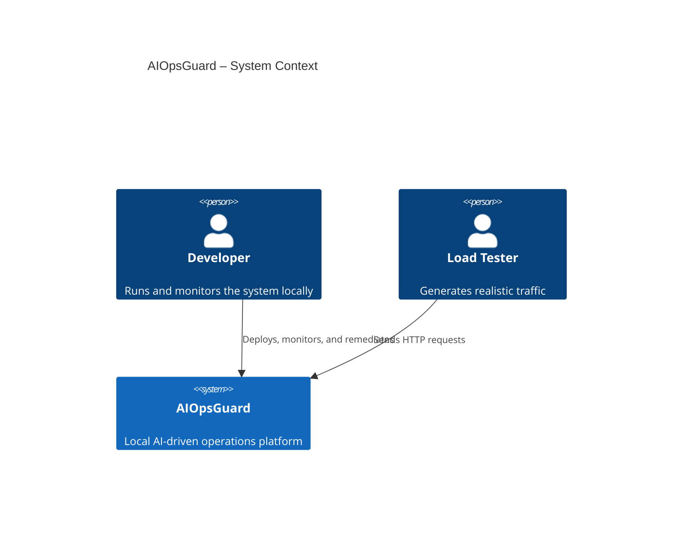
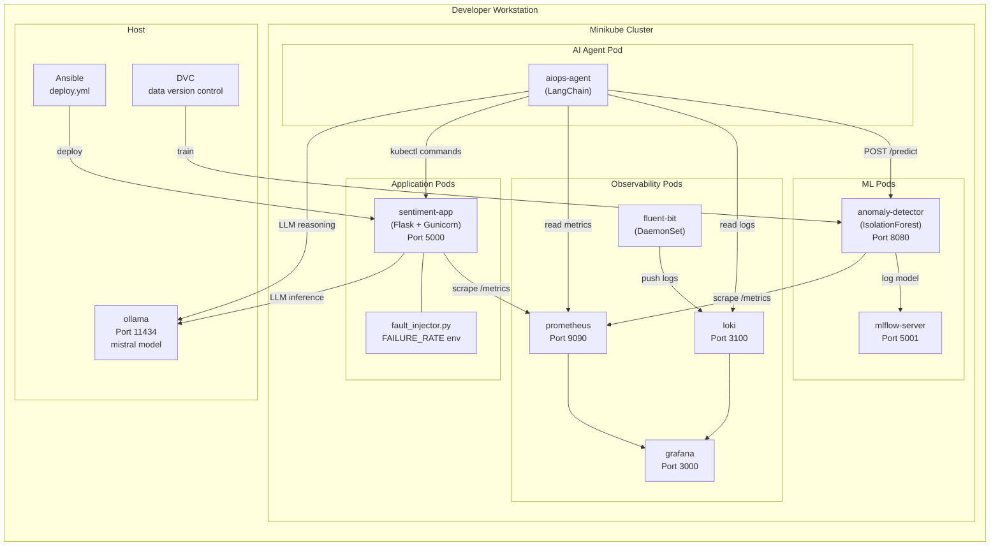

# AIOpsGuard Architecture

## Component Diagram



## Detailed Architecture



## Data Flow

### 1. Request Flow

```
Client → [NodePort 30080] → sentiment-app:5000/analyze
         → fault_injector (probabilistic 500)
         → _classify_sentiment()
         → Ollama API (mistral)
         ← "positive|negative|neutral"
         → Prometheus metrics update
         ← JSON response
```

### 2. Anomaly Detection Flow

```
Prometheus scrapes metrics every 15s
↓
AIOps Agent (runs every 60s)
  ├── QueryLoki({app="sentiment-app"}) → recent error logs
  ├── QueryPrometheus(rate(request_error_total[5m])) → error rate
  └── CallAnomalyDetector([rt_ms, cpu%, mem%, err_rate, req_count])
      ↓
  IsolationForest.predict() → anomaly: true/false
      ↓
  Ollama LLM → root-cause analysis + remediation plan
      ↓
  bash script (kubectl scale / kubectl delete pod)
      ↓
  if "apply" in output → execute script
      ↓
  log to /var/log/aiopsguard/agent.log
```

### 3. MLOps Flow

```
data/logs.csv (synthetic)
  ↓ DVC pipeline
anomaly_detector/train_anomaly_model.py
  ↓ StandardScaler + IsolationForest
model/anomaly_model.pkl (DVC-tracked artifact)
  ↓ MLflow logging
mlflow-server:5001 (metrics + model registry)
  ↓ Docker volume mount
anomaly-detector pod (model loaded at startup)
```

## Port Reference

| Service | Internal Port | NodePort |
|---------|-------------|----------|
| sentiment-app | 5000 | 30080 |
| anomaly-detector | 8080 | — (ClusterIP) |
| mlflow | 5001 | 30501 |
| prometheus | 9090 | 30090 |
| loki | 3100 | — (ClusterIP) |
| grafana | 3000 | 30300 |
| ollama | 11434 | — (host) |

## Security Architecture

```
┌──────────────────────────────────────────┐
│  PodSecurityContext                       │
│  runAsNonRoot: true                       │
│  runAsUser: 1001                          │
│  seccompProfile: RuntimeDefault           │
│                                           │
│  Container SecurityContext                │
│  allowPrivilegeEscalation: false          │
│  readOnlyRootFilesystem: true             │
│  capabilities.drop: [ALL]                 │
└──────────────────────────────────────────┘

Secrets:
  - K8s Secret: aiopsguard-secrets
    - MLFLOW_TRACKING_URI
  - Never committed to git (use .gitignore)

Network:
  - Services use ClusterIP internally
  - Only selected ports exposed via NodePort
  - No external internet access required at runtime
```
