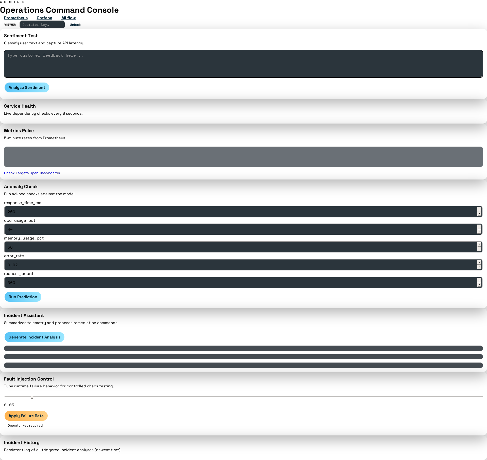

# AIOpsGuard User Guide and Product Documentation

Version: 1.0

## 1. Introduction to the Software

AIOpsGuard is a local-first AIOps and MLOps platform for a Flask-based sentiment analysis service. It demonstrates how modern operations workflows can be automated with observability, anomaly detection, and AI-assisted incident response.

At a high level, AIOpsGuard combines:

- A sentiment API built with Flask.
- A machine learning anomaly detector (IsolationForest) for operational signals.
- MLflow for experiment tracking and model registry.
- Prometheus, Loki, and Grafana for metrics, logs, and dashboards.
- An optional LangChain + Ollama agent for root-cause analysis and remediation guidance.

Primary goals in version 1.0:

- Provide a complete local environment for AIOps experimentation.
- Show end-to-end training, serving, monitoring, and incident triage.
- Support both Docker Compose and Kubernetes (Minikube + Ansible) deployment paths.

## 2. Installation and Setup Instructions

### 2.1 Prerequisites

Install the following on your machine:

- Docker 24+
- Python 3.10+
- Git 2.40+
- Ollama 0.1.32+ (for local LLM features)

Optional for Kubernetes mode:

- Minikube 1.32+
- kubectl 1.28+
- Ansible 9+

### 2.2 Clone the Repository

```bash
git clone https://github.com/sadiqhussain13/AIOpsGuard-Local-AI-Driven-Operations-for-a-Sentiment-Analysis-Service.git
cd AIOpsGuard-Local-AI-Driven-Operations-for-a-Sentiment-Analysis-Service
```

### 2.3 Set Up Python Environment

Windows (PowerShell):

```powershell
python -m venv venv
.\venv\Scripts\Activate.ps1
python -m pip install --upgrade pip
python -m pip install -r requirements.txt
```

Linux/macOS:

```bash
python -m venv venv
source venv/bin/activate
python -m pip install --upgrade pip
python -m pip install -r requirements.txt
```

### 2.4 Pull the LLM Model (Recommended)

```bash
ollama pull mistral
```

### 2.5 Train the Anomaly Model

```bash
make train
```

Expected output:

- A trained model file at model/anomaly_model.pkl.
- A training run logged in MLflow (when MLflow endpoint is reachable).

### 2.6 Start the Platform

Docker Compose mode (recommended for local quick start):

```bash
make up
```

Expected service endpoints:

- App UI: http://localhost:5000/ui
- Sentiment API: http://localhost:5000/analyze
- Anomaly detector: http://localhost:8080
- Prometheus: http://localhost:9090
- Loki: http://localhost:3100
- Grafana: http://localhost:3000
- MLflow: http://localhost:5001

Default operator key in Compose mode:

- X-API-Key: aiopsguard-dev-key

Kubernetes mode (optional):

```bash
ansible-playbook ansible/deploy.yml
```

## 3. Step-by-Step Usage Instructions

### Step 1: Verify Services Are Healthy

Open the dashboard:

- http://localhost:5000/ui

Or call service check API:

```bash
curl http://localhost:5000/ui/api/services
```

Expected result:

- JSON status for app, Prometheus, Loki, MLflow, Ollama, and anomaly detector.

### Step 2: Run Sentiment Analysis

```bash
curl -X POST http://localhost:5000/analyze \
  -H "Content-Type: application/json" \
  -d '{"text":"This platform is very helpful"}'
```

Expected result:

- HTTP 200 with JSON: {"sentiment":"positive|negative|neutral"}

### Step 3: Run Anomaly Detection Prediction

```bash
curl -X POST http://localhost:8080/predict \
  -H "Content-Type: application/json" \
  -d '[200.0, 40.0, 50.0, 0.01, 300.0]'
```

Expected result:

- HTTP 200 with JSON: {"anomaly": false|true, "score": <number>}

### Step 4: Review Metrics and Dashboard

- Open Prometheus: http://localhost:9090
- Open Grafana: http://localhost:3000
- Open app metrics summary: http://localhost:5000/ui/api/metrics

Expected result:

- You can observe throughput, error rates, latency, and anomaly prediction trends.

### Step 4A: Capture UI Screenshots Automatically (Docker)

Yes, this is feasible in version 1.0 using a Docker screenshot container.

This project includes an automation script:

- docs/capture_screenshots.ps1

Run it from repository root (PowerShell):

```powershell
powershell -ExecutionPolicy Bypass -File .\docs\capture_screenshots.ps1
```

What it does:

- Uses the Docker image lifenz/docker-screenshot.
- Captures screenshots for app UI, Grafana, Prometheus, MLflow, and anomaly health endpoint.
- Saves images to docs/screenshots.

Generated files:

- docs/screenshots/01-operations-dashboard.png
- docs/screenshots/02-grafana-home.png
- docs/screenshots/03-prometheus-home.png
- docs/screenshots/04-mlflow-home.png
- docs/screenshots/05-anomaly-health.png

If your services run on different ports or hosts, edit the URL list inside docs/capture_screenshots.ps1.

### Step 5: Use Incident Assistant (Operator Mode)

```bash
curl http://localhost:5000/ui/api/incident \
  -H "X-API-Key: aiopsguard-dev-key"
```

Expected result:

- Incident summary with root cause, severity, reasoning, and remediation script.

### Step 6: Simulate Failures Using Fault Injection

Increase failure rate:

```bash
curl -X POST http://localhost:5000/ui/api/failure-rate \
  -H "Content-Type: application/json" \
  -H "X-API-Key: aiopsguard-dev-key" \
  -d '{"failure_rate": 0.5}'
```

Expected result:

- Half of incoming /analyze requests can return HTTP 500.
- Error metrics and logs increase accordingly.

### Step 7: View Incident History

```bash
curl http://localhost:5000/ui/api/incident/history
```

Expected result:

- Persistent list of recent incidents from SQLite storage.

### Step 8: Stop the Stack

```bash
make down
```

## 4. Functionality Explanations

### 4.1 Sentiment Analysis Service

- Endpoint: POST /analyze
- Input: JSON payload containing text.
- Output: A single sentiment label.
- Notes:
  - Uses Ollama via LangChain when available.
  - Falls back to neutral if LLM is unavailable.
  - Exposes Prometheus metrics at /metrics.

### 4.2 Fault Injection

- Purpose: Controlled chaos testing.
- Mechanism: FAILURE_RATE from 0.0 to 1.0.
- Behavior: Injects HTTP 500 responses probabilistically on /analyze.

### 4.3 Anomaly Detector Service

- Endpoint: POST /predict
- Model: StandardScaler + IsolationForest.
- Input feature order:
  1. response_time_ms
  2. cpu_usage_pct
  3. memory_usage_pct
  4. error_rate
  5. request_count
- Output:
  - anomaly: boolean
  - score: numeric anomaly score

### 4.4 Model Training and Experiment Tracking

- Training script: anomaly_detector/train_anomaly_model.py
- Data source: data/logs.csv
- Artifact output: model/anomaly_model.pkl
- Tracking: MLflow logs parameters, metrics, and model artifacts.

### 4.5 Observability Stack

- Prometheus: Scrapes app and detector metrics.
- Loki: Stores logs for query and incident analysis.
- Grafana: Unified dashboard for metrics and logs.

### 4.6 Incident Assistant

- Endpoint: GET /ui/api/incident (operator protected).
- Inputs considered:
  - Prometheus signals (error rate, p95 latency, traffic).
  - Loki logs.
  - Anomaly detector output.
- Output:
  - root_cause
  - severity
  - reasoning
  - remediation_script

### 4.7 Persistent Incident History

- Endpoint: GET /ui/api/incident/history
- Storage: SQLite database (default at /app/data/incidents.db in container).

## 5. Troubleshooting Tips

### 5.1 Python Dependency Errors

Symptom:

- ModuleNotFoundError for packages such as mlflow.

Fix:

```bash
python -m pip install --upgrade pip
python -m pip install -r requirements.txt
```

### 5.2 Model Not Loaded in Anomaly Detector

Symptom:

- /predict returns HTTP 503 with "Model not loaded".

Checks:

- Confirm model/anomaly_model.pkl exists.
- Re-run make train.
- Verify MODEL_PATH in container/environment points to the correct file.

### 5.3 Ollama or LLM Unavailable

Symptom:

- Neutral sentiment fallback frequently.
- Incident assistant may use heuristic fallback.

Checks:

- Ensure Ollama is running on port 11434.
- Run ollama list and verify the mistral model exists.

### 5.4 Service Reachability Problems

Symptom:

- Dashboard service checks show failed dependencies.

Checks:

- Use docker compose ps and inspect unhealthy containers.
- Check container logs for each failing service.
- Confirm ports are not occupied by other local processes.

### 5.5 API Key Unauthorized on Protected Endpoints

Symptom:

- HTTP 401 from /ui/api/incident or /ui/api/failure-rate.

Fix:

- Provide valid X-API-Key header.
- In Compose mode, default is aiopsguard-dev-key unless overridden.

### 5.6 Invalid One-Liner Python Command in docker exec

Symptom:

- SyntaxError from inline Python command.

Cause:

- Missing separator between statements.

Correct pattern:

```bash
docker exec sentiment-app python -c "import urllib.request; print(urllib.request.urlopen('http://mlflow:5001/').status)"
```

### 5.7 Tests Fail Intermittently After Changes

Checks:

- Activate the same virtual environment used for dependency install.
- Reinstall dependencies from requirements.txt.
- Re-run tests with verbose mode for exact failing assertion.

## 6. Testing Scenarios and Expected Results

### 6.1 Automated Unit Test Suite

Command:

```bash
make test
```

Expected result:

- Pytest runs tests in tests/test_app.py and tests/test_anomaly.py.
- All tests pass with status code 0.

### 6.2 API Health Scenario

Action:

- GET /health on app and anomaly detector.

Expected result:

- HTTP 200 and status ok.
- Anomaly detector health includes model_loaded true when model exists.

### 6.3 Sentiment Validation Scenario

Action:

- POST /analyze with missing text.

Expected result:

- HTTP 400 with error message.

Action:

- POST /analyze with valid text.

Expected result:

- HTTP 200 with sentiment field.

### 6.4 Fault Injection Scenario

Action:

- Set failure_rate to 1.0.
- Call /analyze.

Expected result:

- Requests return HTTP 500 consistently.
- Error counters rise in Prometheus.

### 6.5 Anomaly Prediction Input Validation Scenario

Action:

- POST /predict with fewer than five values.

Expected result:

- HTTP 400 with validation message.

Action:

- POST /predict with five numeric values.

Expected result:

- HTTP 200 with anomaly boolean and score.

### 6.6 Incident Assistant Scenario

Action:

- Call /ui/api/incident with valid API key.

Expected result:

- JSON containing root cause analysis and remediation suggestion.
- Record appears in /ui/api/incident/history.

### 6.7 End-to-End Load Scenario

Command:

```bash
make load-test
```

Expected result:

- Sustained requests to /analyze.
- Observable throughput and latency in Prometheus/Grafana.
- If failures are injected, incident assistant should report elevated error indicators.

## Appendix: Recommended Operation Sequence for Version 1.0

1. Install dependencies and pull Ollama model.
2. Train anomaly model.
3. Start stack with Docker Compose.
4. Verify service health.
5. Run API checks and dashboard review.
6. Simulate faults and validate incident workflows.
7. Run unit tests and load test before concluding a validation run.

## UI Screenshot References

After running the screenshot automation script, add or keep these references in documentation:

### Operations Dashboard



### Grafana Home


### Prometheus Home


### MLflow Home


### Anomaly Detector Health Endpoint


